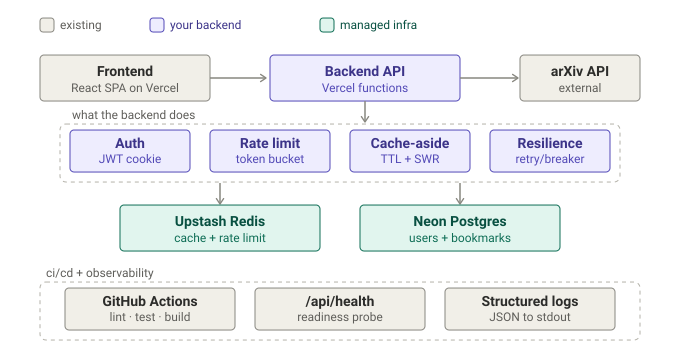

# arXiv Explorer

A full-stack web app for searching and browsing academic papers from arXiv.org — a brutalist
React frontend backed by a cached, rate-limited, resilient API gateway, JWT authentication, and
per-user data in Postgres. Deployed on Vercel.


## Architecture



The frontend never calls arXiv directly. A single, framework-agnostic **gateway** (shared by the
Vercel functions and the local dev server, so dev and prod run identical code) sits in front of
every request and adds:

- **Cache-aside** (TTL + stale-while-revalidate) over arXiv responses — `X-Cache: HIT|MISS`.
- **Per-client rate limiting** (token bucket) — `429` + `Retry-After` + `X-RateLimit-*`.
- **Resilience** — retry with backoff + jitter, per-attempt timeout, and a circuit breaker.

Identity is **email/password auth** with a hand-rolled HS256 JWT carried in an httpOnly,
SameSite cookie. Per-user **bookmarks** live in Postgres, scoped to the authenticated user.
Storage is pluggable: an in-memory adapter (dev/tests, zero setup) or Upstash Redis / Neon
Postgres when their env vars are present — selected at runtime with no code change.

The design decisions are recorded as ADRs:

1. [Cache-aside + rate limiting](docs/adr/0001-cache-aside-and-rate-limiting.md)
2. [Resilience: retry, timeout, circuit breaker](docs/adr/0002-resilience-retry-timeout-circuit-breaker.md)
3. [Auth: JWT in an httpOnly cookie](docs/adr/0003-auth-jwt-cookie.md)
4. [Per-user bookmarks](docs/adr/0004-per-user-bookmarks.md)
5. [CI/CD + observability](docs/adr/0005-ci-and-observability.md)

## Backend / API

All routes live under `api/`. Endpoint handlers are framework-agnostic modules in `api/_lib/`
(unit-tested without a network or database via dependency injection).

| Method | Route | Description |
|--------|-------|-------------|
| `GET` | `/api/arxiv` | Cached, rate-limited, resilient proxy to the arXiv query API |
| `POST` | `/api/auth/signup` · `/api/auth/login` · `/api/auth/logout` | Email/password auth → sets/clears the JWT cookie |
| `GET` | `/api/auth/me` | Current user (hydrates the session from the cookie) |
| `GET` `POST` `DELETE` | `/api/bookmarks` | List / add / remove the **authenticated user's** bookmarks |
| `GET` | `/api/health` | Readiness probe (reports active store/db adapters) |

Every bookmark query is scoped to the user id derived from the cookie — the API never trusts a
client-supplied id. The gateway emits one structured JSON log line per request to stdout.

## Features

- **7 search types** (all fields, title, author, category, abstract, advanced, direct ID) with
  phrase-match optimization, infinite scroll, date-range and sort filters, and search history.
- **155 arXiv categories** across 16 fields; a daily-rotating "Featured Papers" topic.
- **Per-user library** — bookmark papers to your account (synced across devices via Postgres);
  reading history (local).
- **Citations** — copy in APA, MLA, IEEE, Chicago, or BibTeX; bulk BibTeX export.
- **Dark/light mode** and a responsive brutalist UI.

## Tech stack

- **Frontend:** React 19, React Router v7, CSS variables, Lucide icons (Create React App).
- **Backend:** Vercel serverless functions (Node), framework-agnostic handlers in `api/_lib/`.
- **Data:** Neon Postgres (`@neondatabase/serverless`), Upstash Redis (cache/rate-limit) —
  both optional, with in-memory fallbacks.
- **Auth:** bcryptjs + hand-rolled HS256 JWT (`node:crypto`), httpOnly cookie.
- **Tests:** `node:test` (backend) + Jest (frontend). **CI:** GitHub Actions.

## Getting started

```bash
npm install
npm start        # http://localhost:3000
```

No environment variables are required for local dev — the app runs on in-memory adapters
(auth and bookmarks work in a single dev process). See [`.env.example`](.env.example) to wire
real Postgres/Redis locally.

## Testing

```bash
npm run test:api   # backend (node:test) — store, cache, rate limit, resilience, auth, bookmarks
npm test           # frontend (Jest) — contexts and utilities
npm run build      # production build (also lints)
```

The backend was built test-first; logic modules take injected clocks/fetch/sql/writers so they
run with no network or database.

## Deployment (Vercel)

1. Create a **Neon** Postgres database and copy its connection string.
2. In Vercel → Settings → Environment Variables, set:
   - `DATABASE_URL` — the Neon connection string.
   - `JWT_SECRET` — a long random value (`openssl rand -base64 32`).
   - *(optional)* `UPSTASH_REDIS_REST_URL` + `UPSTASH_REDIS_REST_TOKEN` for shared cache/rate limiting.
3. Create the tables: `DATABASE_URL="…" npm run db:migrate`.
4. Redeploy (env-var changes require a new deployment).

Without `DATABASE_URL`, the app falls back to the in-memory store, which on serverless is
per-instance — fine for a demo, not for real persistence.

## Project structure

```
api/
  arxiv.js, bookmarks.js, health.js, auth/*.js   # Vercel function entry points
  _lib/
    store/        # cache/rate-limit store: memory + upstash adapters
    db/           # user/bookmark store: memory + postgres adapters + schema.sql
    auth/         # password (bcrypt), jwt (HS256), cookie, require-auth
    handlers/     # auth, bookmarks, health
    cache.js, rate-limit.js, resilience.js, gateway.js, logger.js, *-app.js
src/
  components/  context/ (Auth, Bookmarks, DarkMode)  pages/  services/  data/
scripts/migrate.js          # applies api/_lib/db/schema.sql
.github/workflows/ci.yml    # lint + test + build on push/PR
docs/adr/                   # architecture decision records
```

## License

MIT — see [LICENSE](LICENSE). Built on the free [arXiv API](https://arxiv.org/help/api/index)
and [Lucide](https://lucide.dev/).
